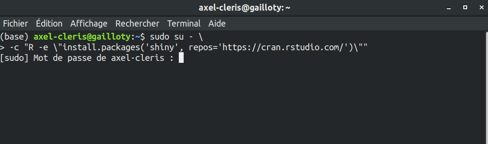
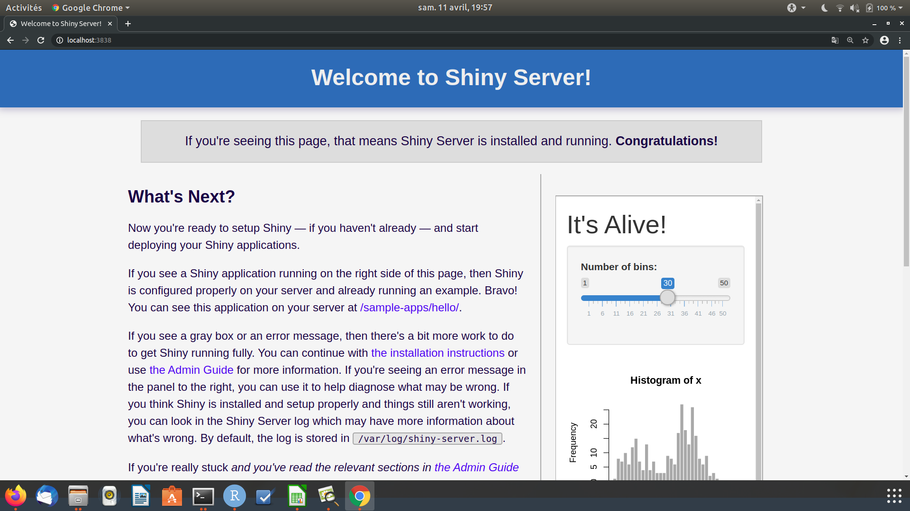
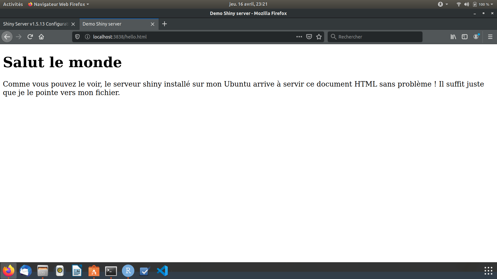
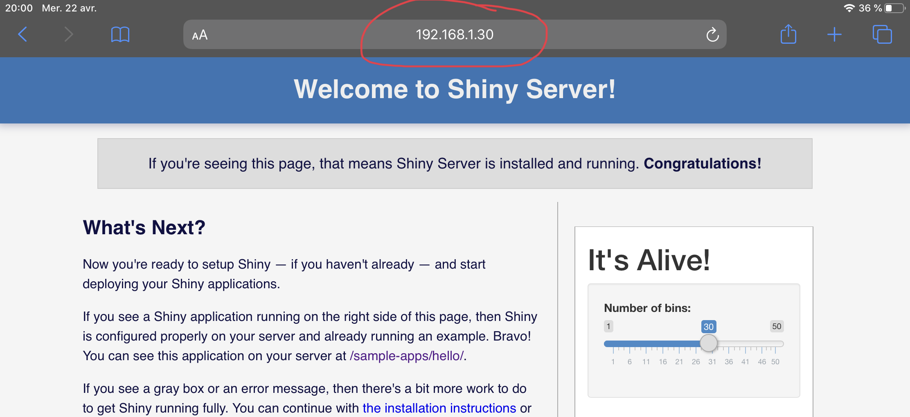

```{r include=FALSE}
knitr::opts_chunk$set(comment = NA)
```


# Introduction

## Découverte de R et de Shiny

Shiny est un package R, développé par RStudio, qui permet la création de pages web interactives sur lesquelles il est possible de réaliser toutes les analyses / actions disponibles sous R.  

J'ai commencé à apprendre la langage R  au début de l'année 2018 dans le cadre du cours "Analyse des données" alors que j'étais en deuxième année de licence Economie et Gestion parcours Economie de l'Université d'Angers. 
On utilisait alors R pour réaliser les analyses factorielles telles que l'Analyse en composantes principales (ACP), l'Analyse des correspondances multiples (ACM), l'Analyse factorielle des correspondance (AFM) avec le package [FactoMiner](http://factominer.free.fr/). 

C'est dans les faits très récemment que j'ai commencé à apprendre Shiny, vers septembre 2019. J'apprenais sur le tas sans réellement avoir un projet spécifique en tête.  
Le premier projet que j'ai réalisé avec Shiny est celui d'un moteur d'extracteur de contenu web (web scraping) du site Indeed. J'avais auparavant construit le webscraper avec Python pour mon utilisation personnelle, extraire les offres d'emplois et les stocker dans un tableau de données Pandas (librairie Python) ensuite les analyse et étudier des tendances.  

J'ai vu l'intérêt de créer une interface utilisateur pour que des personnes puissent utiliser mon programme sans avoir à installer quoi que ce soit. J'ai pensé à utiliser des frameworks Python comme Flask ou Django mais créer une application avec ces frameworks nécessite une connaissance du HTML, du CSS et peut-être du Javascript et surtout il est important d'utiliser un langage de templating comme jinja pour générer dynamiquement les pages. Il était donc tout à fait enviageable de créer l'application avec ces frameworks mais le temps du développement sera grand.  

J'ai donc pensé à Shiny, je pouvais donc capitaliser ma connaissance du langage R pour développer facilement une application sans avoir à me soucier de toutes les spécifications techniques qu'imposaient les frameworks Python.  
J'ai donc décider de créer l'interface pour mon extracteur de contenu avec Shiny et en quelques lignes de code R le résultat est extraordinaire.  

J'ai profité du riche écosystème de packages R pour développer l'application notamment du package `reticulate` pour faire appeler depuis R les classes et fonctions que j'aie définies en Python. C'est très bluffant !
J'ai mis sur [GitHub](http://factominer.free.fr/)  

## Motivation

J'ai décidé d'écrire ce mémoire tout d'abord pour servir de référence au futur moi quand je voudrais développer une prochaine application en shiny. Une chose que j'ai apprise avec les langages de programmation et les packages c'est qu'il est impossible de maîtriser toutes les fonctions, tous les paramètres, que prennent les fonctions, tous les détails d'implémentation ... par coeur. Bien souvent lorsqu'on écrit du code, on se réfère à la documentation des packages, des fonctions pour réaliser ce qu'on veut faire.  

Le problème est que si on n'utilise pas souvent ce package ou certaines fonctions on risque d'oublier comment on les utilise et on se retrouve à chaque fois à réinventer la roue : se référer à la documentation, chercher sur Google, Stackoveflow ...   

Il importe donc de garder des traces des cas d'utilisation qu'on a faites des packages pour vite se référer dans le futur. L'idée est de réduire le stress et de savoir que par le passé on a utilisé ce package et au besoin consulter ce qu'on fait.  

L'autre motivation pour ce travail est permettre aux personnes débutant avec shiny de voir le chemin que j'ai pris pour développer une application. 
Bien que shiny ait une bonne [documentation](https://shiny.rstudio.com/reference/shiny/1.3.2/) et une bonne [Galerie d'application](https://shiny.rstudio.com/reference/shiny/1.3.2/) avec des demos j'ai trouvé assez difficile de débuter le développement de mon application à savoir par exemple faut-il partir sur un `fluidPage`, un `navbarPage` ou encore un `basicPage`. Bien souvent je me retrouve à adapter du code existant pour arriver à peu près à ce que je veux réaliser sans avoir l'impression que je sais ce que je fais. Ainsi le but de ce mémoire est aussi de dissiper tout doute que le débutant en shiny peut avoir. Le but n'est pas de réécrire la documentation de shiny mais plutôt de partager mon expérience et vous aider le plus possible à développer vos applications.   

Aussi je trouve qu'il y a très peu de documentation en ce qui concerne la personnalisation de l'interface utilisateur. A defaut plusieurs applications shiny que je vois se contentent de l'apparence basique basée sur Bootstrap, j'aimerais donc partager mon expérience dans la personnalisation de l'interface utilisateur : création du page d'accueil en HTML, CSS, personnalisation des boutons, touches ...  

Au moment où j'écris cela, je ne suis pas moi-même expert en personnalisation mais ce sont des choses que j'apprendrai. 

## Références

Kevin Ushey, JJ Allaire and Yuan Tang (2020). reticulate: Interface to
  'Python'. R package version 1.15.
  https://CRAN.R-project.org/package=reticulate

# Choix de Linux, installation de shiny, shiny server

Un des points importants avec le langage R est qu'il est fonctionne sur tous les systèmes d'exploitations majeurs : Windows, Mac et Linux. Le même code qu'on écrit avec R sur Windows tourne sans problème sur Mac et Linux. [^1]  

[^1]: Il existe certains packages développés uniquement pour une plateforme en particulier.

J'ai commencé à apprendre shiny sur Windows dans R Studio où j'écris le code et pour visualiser ce que je fais je clique sur le bouton `Run App` présent dans R Studio.  

Pour ce présent projet j'ai choisi de développer sur Linux avec la distribution Ubuntu. Le code R que j'écris peut tourner sur toutes les plateformes. J'ai choisi Linux pour mettre en avant le programme Shiny Server développé par R Studio et qui ne marche que sur Linux. Shiny Server est un serveur installé sur Linux qui permet de déployer les application shiny sur le web.  

Etant donné que je développe mes applications en local sur mon ordinateur je veux bien les tester sur tous les types de périphériques (smartphone, tablette, PS4 ...) avant de les déployer sur Internet. Une fois que ces périphériques sont connectés au réseau local Shiny server peut servir l'application sur une adresse IP. 


## Installation de R et de Shiny Server

A la fin de ce tutoriel vous pourrez faire tourner un serveur shiny sur votre réseau local et accéder au serveur sur votre ordinateur ou tout autre appareil connecté au réseau.  

Shiny Server peut être installé sur plusieurs distributions Linux (Debian, CentOS, openSUSE ... ). Ici je détaille comment je l'ai installé sur mon PC qui tourne sous un **Ubuntu Desktop 18.04 LTS**. Les étapes sont présentées sur le site de [R Studio](https://rstudio.com/products/shiny/download-server/ubuntu/).  

### Installer R sur Ubuntu 14 ou plus  

Par défaut lorsqu'on exécute la commande suivante, c'est la version de R correspondant à la version du système d'exploitation Ubuntu qui est installée. La version Ubuntu 18.04 LTS va installer la dernière version de R disponible au moment de la sortie d'Ubuntu 18.04, ce qui fait qu'il y a un retard de 2 ans. Le serveur shiny marche bien avec les anciennes version de R, mais en deux ans beaucoup d'améliorations ont été apportées au langage, donc pourquoi s'en priver. Il serait bien d'installer la version la plus récente de R. 

```{}
sudo apt-get install r-base
```

Pour installer la dernière version de R il faut tout d'abord ajouter le répertoire CRAN le plus récent au système d'exploitation Ubuntu. Cela permet d'installer la version la plus récente de R car autrement c'est la version (`3.4`) de R qui va être installée.  

La commande suivante permet d'ajouter le répertoire CRAN à la version de Ubuntu.  

```{}
sudo add-apt-repository 'deb https://cloud.r-project.org/bin/linux/ubuntu xenial-cran35/'
sudo apt-key adv --keyserver keyserver.ubuntu.com --recv-keys E298A3A825C0D65DFD57CBB651716619E084DAB9
```

Ensuite exécuter les lignes de commandes suivantes :   
Dans un premier temps on met à jour le gestionnaire de package APT puis on installe R.  

```{}
sudo apt-get update
sudo apt-get upgrade
sudo apt-get install r-base-dev
```

### Installation du serveur Shiny

Shiny Server n'est pas un package R mais un programme à part entière qu'il faut installer sur un système Linux. Ce programme ne tourne que sous Linux comme la plupart des serveurs web. La procédure d'installation dépend de quelle distribution de Linux vous utilisez. Ici je détaille montre comment installer le serveur Shiny sur un système Debian/Ubuntu.  

Si vous avez déjà sur votre PC Linux une version ancienne de R il est recommandé d'installer la version la plus récente pour éviter tout problème lié à la compatibilité.

Pour installer le serveur il faut d'abord installer Shiny et d'autres packages de façon globale sur le système d'exploitation.  
Un package installé globalement est valable pour tous les utilisateurs de l'ordinateur.
Pour installer Shiny globalement sur le système, exécuter la commande suivante dasn votre terminal. 

```{}
sudo su - \
-c "R -e \"install.packages('shiny', repos='https://cran.rstudio.com/')\""
```

Dans bien des cas il vous faut aussi installer le package `digest` et/ou d'autres packages sur lesquels dépend votre application.  

```{}
sudo su - \
-c "R -e \"install.packages(c('digest', 'tidyverse'), repos='https://cran.rstudio.com/')\""
```

Il vous sera demandé d'entrer votre mot de passe pour donner la permission aux packages de s'installer globalement.



Par défaut lorsqu'on utilise R via le console ou via RStudio les packages sont installés premièrement dans le répertoire `/home` de l'utilisateur. Il existe également d'autres répertoires où les packages peuvent être installés.  
Avec la fonction `.libPaths()` définie dans R vous pouvez regarder là où R installe les packages.

```{r}
.libPaths()
```

Le premier chemin est le lieu par défaut où sera installé tous les packages. Pour nous ici nous avons décidé d'installer Shiny au niveau global, ce package sera donc installé dans un des dossiers `usr/lib/`.  

Généralement pour gérer les répertoires dans lesquels les packages seront installés vous pouvez vous référer au fichier `.Rprofile` pour définir le comportement de R.


Après l'installation de R Shiny globalement on peut installer le serveur Shiny.  
L'installation du serveur se fait avec **Gdebi** l'installateur de pacquet `.deb`.

L'installation se fait en deux étapes :   

- Dans un premier temps on se place dans un sur quelque part dans notre répertoire (typiquement le Bureau) puis on télécharge le paquet `.deb` de Shiny Server avec wget. 

Installer **Gdebi** avec la commande `sudo apt-get install gdebi-core` s'il n'est pas installé.  

```{}
cd
sudo apt-get install gdebi-core
wget https://download3.rstudio.org/ubuntu-14.04/x86_64/shiny-server-1.5.13.944-amd64.deb
```

- Puis on installe en tant qu'administrateur le paquet shiny-server.

```{}
sudo gdebi shiny-server-1.5.13.944-amd64.deb
```

Une fois que le serveur Shiny est correctement installé vous pouvez accéder au serveur au `localhost:3838` ou `http://127.1.1.0:3838` le port 3838 est défini par défaut dans le fichier de configuration.  

Vous verrez cette page dans votre navigateur si vous entrez l'adresse `localhost:3838` ou `http://127.1.1.0:3838`.  




## Administrer le serveur Shiny

Le fichier de configuration du serveur shiny se trouve à l'emplacement `/etc/shiny-server/shiny-server.conf`. 

```{bash}
cat /etc/shiny-server/shiny-server.conf
```

Nous allons passer en revue les points importants à noter dans ce fichier de configuration.  

```{}
run_as axel_cleris;
```


Le seul changement que j'ai fait jusque là dans ce fichier est de changer les deux premières lignes pour specifier au serveur de démarrer les applications en tant que `axel-cleris`. Sans faire de modification le serveur marcherait quand même car lors de l'installation du serveur un compte user shiny a été créé sur l'ordinateur. Nous pouvons voir les 10 derniers utilisateurs crées sur la machine en utilisant la commande suivante.  

```{bash}
cut -d : -f 1 /etc/passwd | tail -10
```

Intéressons-nous maintenant au reste de ce fichier de configuration.

```{}
server {
  listen 3838;

  # Define a location at the base URL
  location / {

    # Host the directory of Shiny Apps stored in this directory
    site_dir /srv/shiny-server;
    .....
```

Le serveur écoute au port 3838. Vous pouvez changer ce port si vous le souhaitez, dans mon cas je n'ai pas eu besoin de le changer.  
Le fichier de configuration définit une location racine puis crée un dossier qui héberge les applications Shiny, ce dossier est situé au `/srv/shiny-server`.  

Lorsque vous tapez dans votre navigateur `localhost:3838` ou `127.1.1.0:3838` c'est le contenu de ce dossier que le serveur renvoie.  

Regardons ce qu'il y a à l'intérieur du dossier `/srv/shiny-server`.  

```{bash}
ls /srv/shiny-server/
```

Il existe un fichier `index.html` et un dossier samples-apps. Pour ceux qui connaissent un peu le web vous devrez savoir que ce fichier est automatiquement lu lorsqu'un serveur pointe vers le répertoire. En fait c'est ce fichier qui est rendu dans le navigateur lorsque nous allons à l'adresse `localhost:3838`.   

C'est la même logique que j'utilise pour héberger le présent document sur mon [Github](https://github.com/agailloty?tab=repositories). Lorsque vous vous rendez dans le [répertoire qui héberge ce document](https://github.com/agailloty/shiny-dev), vous verrez un fichier nommé `index.html`, c'est ce fichier qui est rendu dans votre navigateur lorsque vous tapez https://agailloty.github.io/shiny-dev . 

Il est possible de modifier le contenu de ce fichier HTML ou d'ajouter un autre fichier HTML qui sera servi dans le même dossier. Par exemple je vais écrire un document HTML basique nommé `hello.html` que je mettrai dans le dossier.   
Voici le contenu du fichier HTML

```{}
<!DOCTYPE html>
<html>
  <head>
    <title>Demo Shiny server</title>
  </head>
  <body>
    <h1> Salut le monde</h1>
    <p>
      Comme vous pouvez le voir, le serveur shiny installé sur mon Ubuntu arrive à servir ce document HTML sans problème ! Il suffit juste que je le pointe vers mon fichier.
    </p>
  </body>
</html>
```

Je copie ce fichier vers le dossier `/srv/shiny-server`. Les opérations de copie ou de modifications dans ce dossier requiert des privilèges administrateur.  

```{}
sudo cp Bureau/shiny/learning/hello.html /srv/shiny-server
```

Voilà donc le résultat dans mon navigateur à l'adresse `127.1.1.0:3838/hello.html`. 



Lorsqu'on exécute du code R il arrive souvent que le console renvoie des messages d'avertissement ou d'erreur sur le fonctionnement de l'application. Dans le fichier de configuration nous voyons que ces messages sont enregistrés dans le dossier `/var/log/shiny-server`.   

```{}
# Log all Shiny output to files in this directory
    log_dir /var/log/shiny-server;

    # When a user visits the base URL rather than a particular application,
    # an index of the applications available in this directory will be shown.
    directory_index on;
  }
}
```


# Servir vos applications Shiny

Bien qu'il soit intéressant de servir des pages HTML statiques directement à partir du serveur shiny vous vous doutez bien que ce n'est pas pour cette tâche que nous avons installé Shiny Server.  

Le serveur Shiny permet de déployer votre application sur le web permettant ainsi à d'autres personnes de l'utiliser. Dans cette section je vais détailler deux manières de déployer votre application Shiny pour que d'autres personnes l'utilisent. Je parlerai de comment servir votre application sur votre local puis comment permettre que des personnes en dehors de votre local l'utilisent. Pour cette dernière option je ne me restreindrai qu'à présenter les options gratuites.  


## Servir l'application dans votre réseau local (LAN)

Une fois que vous avez fini de configurer le serveur shiny sur votre ordinateur tous les appareils connectés au même réseau que votre ordinateur peuvent accéder au serveur par le biais de l'adresse IP de votre ordinateur.  
Le routeur de votre fournisseur d'accès Internet (FAI) assigne à chaque appareil connecté à votre réseau une adresse IP locale pour identifier vos appareils dans le réseau local. Ce qui nous intéresse ici c'est de trouver l'adresse IP de l'ordinateur sur lequel est installé le serveur Shiny. 
Avec le terminal nous pouvons utiliser les commandes `ip` ou `ifconfig` pour afficher les informations réseau de l'ordinateur. L'adresse qui nous intéresse commence par `inet` donc nous allons n'afficher que ces informations. L'adresse IP de l'ordinateur visible sur le local est le `192.168.1.30`, donc pour accéder au serveur Shiny à partir d'un autre appareil connecté au réseau est `192.168.1.30:3838`.

```{bash}
ip a | grep inet
```

Je vais me connecter au serveur Shiny sur ma tablette. 



Dès lors vous pouvez utiliser votre application sur tous les appareils connectés à votre réseau local. Cela peut aider à observer le comportement de l'application sur différents types d'écran pour affiner l'interface.  


## Accéder à l'application sur Internet

L'application qu'on a déployé sur le serveur Shiny local ne peut être accessible qu'aux appareils connectés au réseau local, une personne en dehors du réseau ne peut y accéder car il n'est pas sur Internet. Je vais dans cette sous-section vous présenter deux solutions pour déployer vos applications de manière à ce que toute personne disposant du lien peut y accéder grâce à Internet. Je présenterai deux solutions : `shinyapps.io` lorsque votre application est prête à l'emploi et que vous voulez le rendre disponible et une solution pour ouvrir votre réseau local à Internet. 

### Avec `shinyapps.io`

// A FAIRE

### Sous un tunnel SSH avec `ngrok`

// A FAIRE


# Structure d'une application Shiny

Les applications Shiny permettent d'exécuter du code R dans un environnement web. Les applications Shiny possèdent deux composantes : l'interface utilisateur et les fonctionnalités. 


## Références

Download Shiny Server for Ubuntu 14.04 or later https://rstudio.com/products/shiny/download-server/ubuntu/

Ubuntu Packages for R : https://cran.rstudio.com/bin/linux/ubuntu/README.html
 
# Structure d'une application Shiny

# Les Interfaces

## Générer dynamiquement une interface utilisateur

L'interface de l'application est le produit final pour l'utilisateur de l'application. L'interface doit gérer deux types d'évènements : les entrées et les sorties. Les entrées correspondent aux commandes ou aux données que l'utilisateur saisit pour que R les interprète. Les sorties sont les résultats des traitements et calculs que fait R avec les entrées de l'utilisateur.  


# Annexes


# Glossaire

